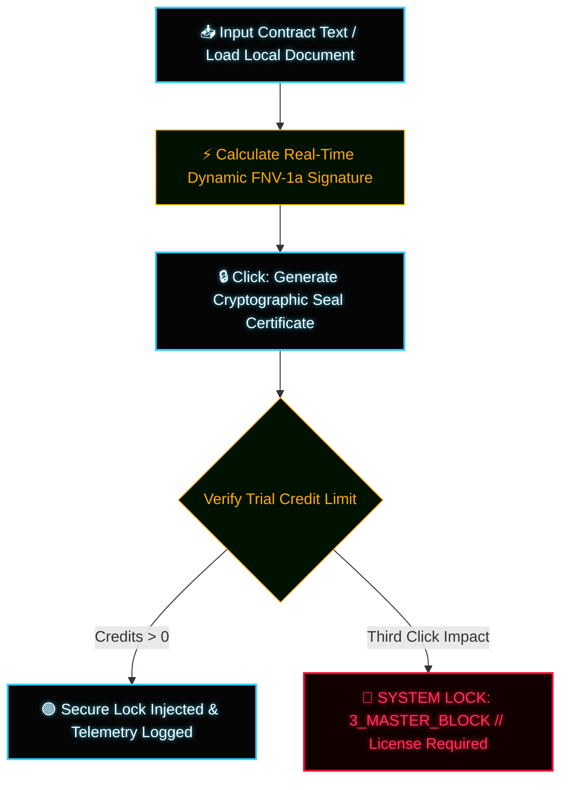

# ⚡ QFS Offline Contract Validator - CRYPTOGRAPHIC INTEGRITY SEALS ⚡

A high-performance, zero-knowledge standalone client-side dashboard engineered in native vanilla JavaScript to digitally sign legal drafts, compute cryptographic integrity hashes, and validate document structures offline with zero lag.

---

## 🔬 Core Cryptographic Protocols

* **Inmutable Root Hashing:** The internal engine utilizes a síncronous implementation of the FNV-1a mathematical loop to forge an 8-character uppercase signature, guaranteeing that any structural variation or alteration breaks the validation chain instantly.
* **Offline-First Security Sandbox:** Processes data streams locally inside the web browser's memory registers, ensuring zero-knowledge retention and absolute privacy.

---

## 📐 System Flowchart Architecture (Mermaid)

---

## 🛠️ Deployment Instructions

1. Clone this repository structure into your local sandboxed terminal.
2. Verify `contract-validator.html` is compiled.
3. Execute `contract-validator.html` locally via any modern client-side browser interface.

---
`ARCHITECTURE VERIFIED // CRYPTO SEAL LEVEL OMEGA // ENVIRONMENT: ATLANTIC-BASALT`

---

## 📄 Proprietary License & Intellectual Property

Copyright (c) 2026 Rafael // QFS Alpha Core Utilities. All rights reserved.

This software and its associated documentation files are proprietary and confidential. No part of this architecture may be copied, modified, distributed, or mirrored without explicit written authorization from the author. Usage is strictly restricted to authorized client sandbox telemetry evaluations.
